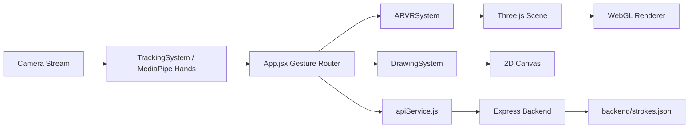
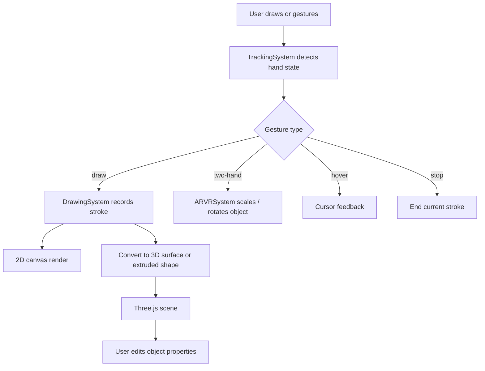
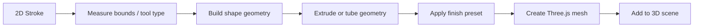

# AR Studio

AR Studio is a browser-based AR/VR drawing and creation workspace built with React, Vite, Three.js, and MediaPipe Hands. It lets users draw with the mouse, touch, hand gestures, or a pen/pencil style brush, then convert those drawings into 3D objects, 3D surface boards, and 3D text inside the same scene.

The app is designed to feel like a creative studio rather than a simple demo. It includes 2D sketching, 3D object placement, material presets, city/building objects, responsive controls, camera switching, cloud save/load, and object property editing.

## What This Project Does

- Draw freeform strokes and geometric shapes in 2D.
- Use hand tracking to draw, hover, pinch, and perform two-hand scaling and rotation.
- Create 3D primitives, realistic city/building objects, and decorative shapes.
- Convert 2D drawings into 3D extruded shapes.
- Convert the current drawing canvas into a 3D surface board.
- Create real 3D text objects from user input.
- Edit selected 3D objects with width, height, depth, color, and opacity controls.
- Save, load, list, and delete drawing sessions through a backend API.
- Switch between front and back camera modes.
- Work across laptop, desktop, and mobile screen sizes.

## Core Features

### Drawing

- Pen, pencil, bead, neon, solid line, and square brush modes.
- Shape drawing tools for line, rectangle, circle, triangle, diamond, hexagon, star, and heart.
- Quick color swatches plus custom color picker.
- Brush size slider with live updates.
- Undo and clear actions.

### 3D Creation

- 3D primitives such as cube, sphere, cylinder, cone, torus, capsule, prism, pyramid, gem, and more.
- Decorative composite shapes such as flower, shield, arrow, leaf, moon, sun, cloud, heart, and others.
- City and structure objects such as building, skyscraper, shop, streetlamp, fountain, bridge, tower, wall, door, window, stairs, and fence.
- Material presets: matte, gloss, metal, and glass.
- Duplicate, replace, move, rotate, scale, and delete selected 3D objects.
- Touch-based drag and pinch controls on 3D objects.
- Two-hand gesture scaling and rotation.

### Advanced Conversion

- Convert 2D shape strokes into extruded 3D geometry.
- Convert the full drawing canvas into a 3D surface board.
- Create extruded 3D text objects.
- Keep the drawing workflow and 3D workflow in the same app session.

### Camera and Interaction

- Front and back camera switching.
- Default back-camera behavior for live AR-style capture on supported devices.
- Gesture-driven drawing and manipulation through MediaPipe Hands.
- Mirror-aware coordinate handling when using the front camera.

### Backend Storage

- Save stroke sessions to disk.
- Load stroke sessions later.
- List saved sessions.
- Delete sessions.

## Tech Stack

- React 19
- Vite 6
- Three.js 0.184
- three-stdlib
- MediaPipe Hands
- Express.js backend
- CORS and JSON session storage

## Project Structure

```text
AR/
├── backend/
│   ├── package.json
│   └── server.js
├── public/
├── src/
│   ├── App.jsx
│   ├── index.css
│   ├── main.jsx
│   └── utils/
│       ├── apiService.js
│       ├── ARVRSystem.js
│       ├── DrawingSystem.js
│       └── TrackingSystem.js
├── package.json
├── vite.config.js
├── eslint.config.js
└── README.md
```

## How It Works

The app is split into three main runtime systems:

- `TrackingSystem` reads camera frames and converts hand landmarks into gestures and coordinates.
- `DrawingSystem` converts the gesture stream into 2D strokes, shapes, and brush effects.
- `ARVRSystem` takes 2D drawings or direct object actions and turns them into a Three.js scene.

The React UI in `App.jsx` connects those systems and provides the toolbar, shape picker, camera mode toggle, save/load controls, and property editor.

## Architecture Diagram



## Interaction Workflow



## 2D To 3D Pipeline



## Features In Detail

### DrawingSystem

`src/utils/DrawingSystem.js` stores strokes as structured data and renders them back to the 2D canvas. It supports:

- Freeform bead strokes.
- Pencil-like strokes.
- Straight lines and neon lines.
- Square stamps.
- Bounded shape strokes such as rectangle, circle, triangle, diamond, hexagon, star, and heart.

Each stroke stores:

- Points
- Color
- Brush size
- Brush type
- Draw tool

That data is what makes later conversion into 3D possible.

### TrackingSystem

`src/utils/TrackingSystem.js` uses MediaPipe Hands to interpret camera frames.

- One hand in pinch mode becomes drawing input.
- Two hands become transform input for 3D scaling and rotation.
- The system smooths coordinates to reduce jitter.
- The app flips coordinates when the workspace is mirrored for front-camera mode.

### ARVRSystem

`src/utils/ARVRSystem.js` owns the Three.js scene.

- It creates lights, grid floor, camera, orbit controls, and transform controls.
- It creates 3D primitives and composite shapes.
- It supports material presets through a shared material builder.
- It converts strokes into 3D meshes.
- It converts the entire drawing canvas into a 3D surface board.
- It creates real 3D text using `TextGeometry`.
- It lets the selected object be moved, resized, recolored, or deleted.

### App UI

`src/App.jsx` is the orchestration layer.

- It connects gesture data to drawing and 3D behavior.
- It switches between 2D and 3D modes.
- It manages camera mode.
- It exposes the toolbar, shape selector, material selector, and property panel.
- It sends save/load requests to the backend.

## How To Use The App

### Start The Project

Install frontend dependencies:

```bash
npm install
```

Install backend dependencies:

```bash
cd backend
npm install
```

Run the frontend only:

```bash
npm run dev
```

Run the backend only:

```bash
cd backend
npm run dev
```

Run both together from the root:

```bash
npm run dev:all
```

Build the app for production:

```bash
npm run build
```

Preview the production build:

```bash
npm run preview
```

Run lint checks:

```bash
npm run lint
```

### Basic Drawing Flow

1. Open the app in the browser.
2. Allow camera access.
3. Use the drawing toolbar to pick a pen, pencil, or shape tool.
4. Draw on the canvas using hand gesture input or mouse/touch interactions.
5. Adjust brush size, brush style, and color from the left toolbar.

### Convert Drawings To 3D

1. Draw a shape or stroke in 2D.
2. Click `2D→3D` to convert the current strokes into 3D meshes.
3. Click `Surface→3D` to turn the whole drawing canvas into a 3D display board.
4. Click `Text→3D` to place 3D text in the scene.
5. Use `Properties` to resize the selected object and change its color or opacity.

### Work In Back Camera Mode

1. Click `Back Cam` to use the rear camera.
2. Draw with hand gestures or use the toolbar to create shapes.
3. Switch to `Front Cam` when you want mirrored selfie-style interaction.

### Work In 3D Mode

1. Click `3D!` to switch the drawing workspace into 3D mode.
2. Add a shape from the 3D shape selector.
3. Use move, rotate, and scale controls.
4. Drag selected objects with one finger or pointer.
5. Use two-finger pinch gestures to scale and rotate objects.

## Toolbar Reference

### Drawing Toolbar

- Draw Tool: choose pen, pencil, line, rectangle, circle, triangle, diamond, hexagon, star, or heart.
- Brush Style: choose bead, pencil, solid line, neon line, or square.
- Brush Color: quick swatches and custom picker.
- Brush Size: live size control.
- Undo Last: remove the latest stroke.

### 3D Toolbar

- Add Shape: create the selected 3D primitive or structure.
- Move: switch transform controls to translation.
- Rotate: switch transform controls to rotation.
- Scale: switch transform controls to scaling.
- Duplicate Selected: clone the selected object.
- Replace Selected: swap the selected object with a new shape.
- Delete Selected: remove the selected object.
- Properties: edit size, color, and opacity of the selected object.

## Backend API

The backend stores stroke sessions in `backend/strokes.json`.

### Endpoints

- `GET /api/health` returns backend health.
- `GET /api/sessions` lists saved sessions.
- `GET /api/strokes/:session` loads a session.
- `POST /api/strokes/:session` saves a session.
- `DELETE /api/strokes/:session` deletes a session.

### Example Save Payload

```json
{
	"strokes": [
		{
			"points": [{ "x": 100, "y": 120 }],
			"color": "#8b5a2b",
			"baseSize": 12,
			"type": "bead",
			"tool": "pen"
		}
	]
}
```

## Responsive Behavior

The interface is designed to remain usable on mobile, tablet, and laptop screens.

- Toolbars are positioned to avoid overlapping the drawing area.
- The workspace fills the screen and scales with window size.
- Camera, canvas, and Three.js layers resize together.
- The layout uses compact controls so it remains usable on smaller displays.

## Notes And Limitations

- The app depends on browser camera permission for tracking features.
- 3D text uses a bundled font geometry path, so it works without external runtime downloads.
- Large Three.js bundles can trigger a Vite size warning; the build still succeeds.
- Performance depends on device GPU and camera quality.

## Development Notes

- Frontend source lives in `src/`.
- Backend source lives in `backend/`.
- Gesture handling, shape conversion, and 3D scene management are split into separate modules to keep the app maintainable.
- The codebase is already linted and production-buildable.

## Suggested Next Improvements

- Add a text input panel instead of the browser prompt.
- Add code-splitting to reduce the bundle warning.
- Add more architectural objects such as roads, windows, doors, lights, and trees.
- Add save/load naming and thumbnail previews for sessions.
- Add real plane detection for placing objects on a physical surface.

## License

No license has been specified yet.